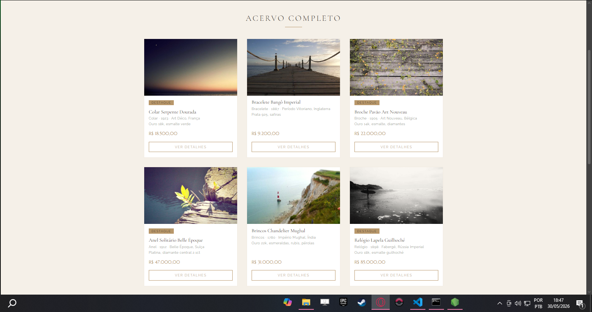
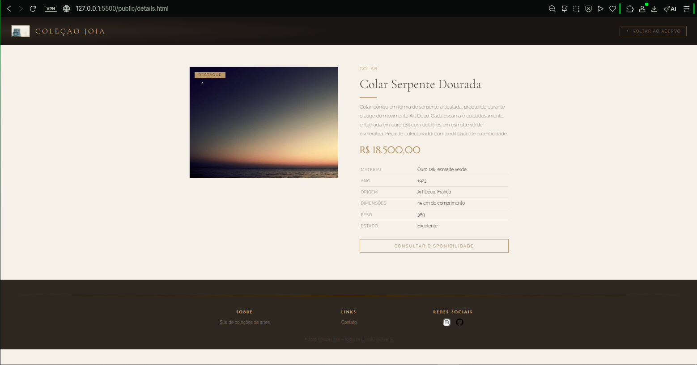
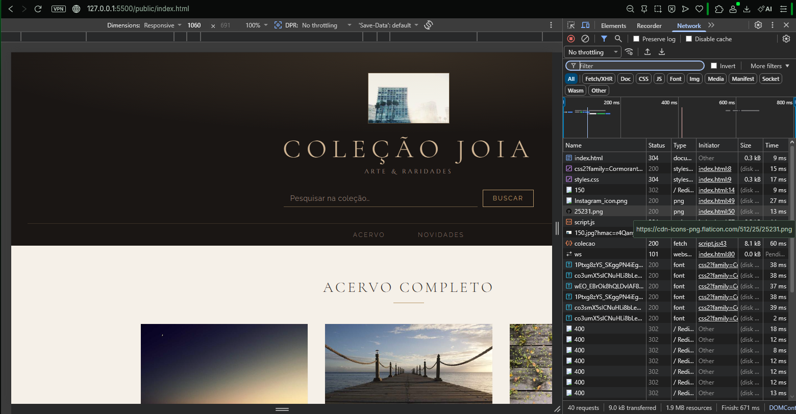
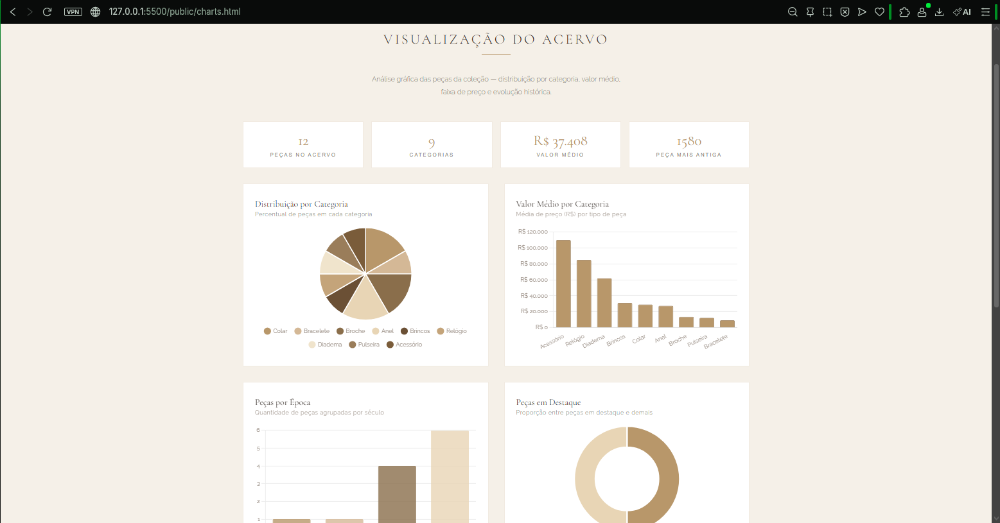
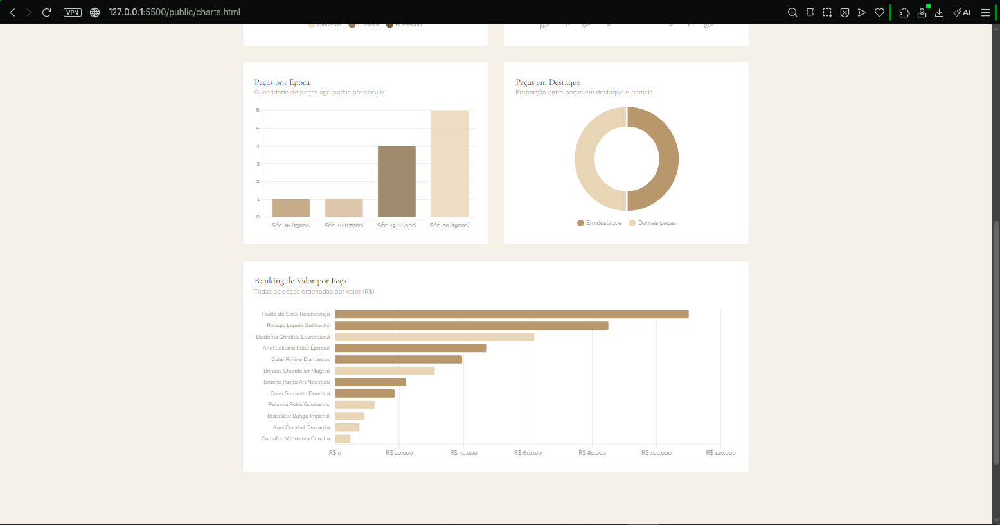
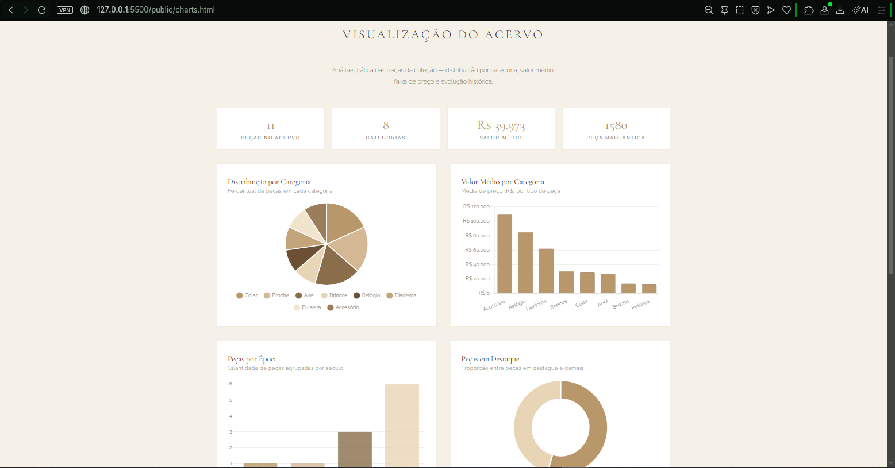
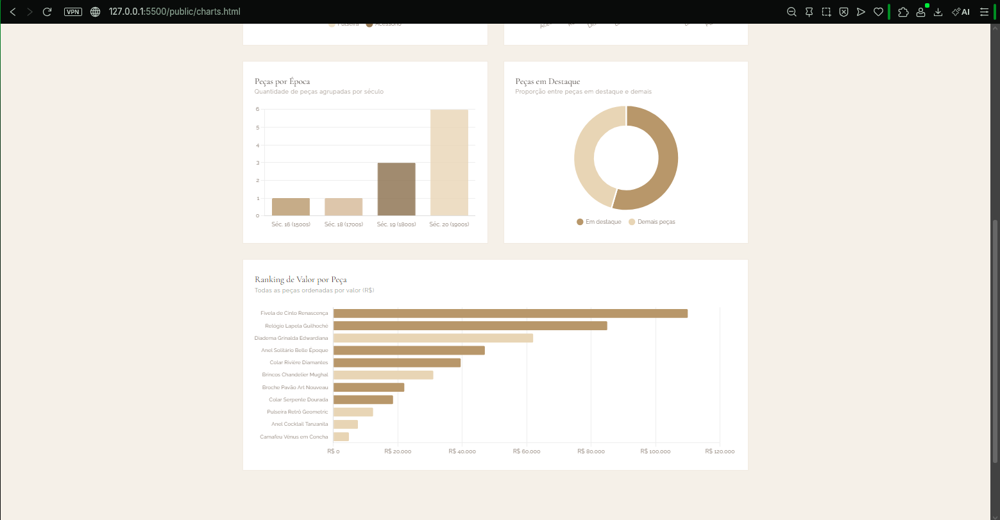

# Trabalho Prático - Semana 13

Home com cards e página de detalhes com JSON Server 
Nesta atividade, você vai migrar a estrutura de dados que estava dentro do arquivo JavaScript para um arquivo db.json e utilizar o JSON Server como um “backend” simples para o seu projeto. Para este ambiente local de desenvolvimento, utilizamos além do JSONServer, o Node.js.
IMPORTANTE: Assim como informado anteriormente, capriche na etapa pois você vai precisar dessa parte para as próximas semanas. 

## Informações Gerais

- Nome: Gabriel Vinícius Soares Doti
- Matricula: 814583

resumo:json:
colecao: É uma array de objetos que guarda o inventário das joias antigas. Cada objeto tem os dados técnicos, o preço, o ano que foi feita e o estado de conservação dela.

{
  "id": 1,
  "titulo": "String - Nome da joia",
  "categoria": "String - Tipo do item",
  "material": "String - Ouro, diamantes, etc",
  "ano": 1923,
  "origem": "String - Movimento e país",
  "preco": 18500,
  "descricao": "String - Texto explicativo",
  "imagem": "String - URL da foto",
  "destaque": true,
  "dimensoes": "String - Tamanho da peça",
  "peso": "String - Peso em gramas",
  "estado": "String - Como tá a conservação"
}

## Prints do trabalho

<<  COLOQUE A IMAGEM - TELA DE CARDS DE PRODUTOS - AQUI >>

<<  COLOQUE A IMAGEM - TELA DE DETALHE DO PRODUTO - AQUI >>

<<  COLOQUE A IMAGEM - TELA DO CONSOLE - AQUI >>

<< SEMANA 14 PRINTS >>

os charts tem como principal funçao exibir graficos pizza, barras e rosca com os principais dados dos produtos e alem disso no topo da pagina mostram um resumo das estatisticas. 